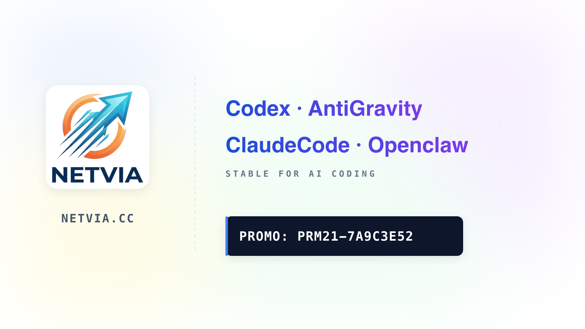
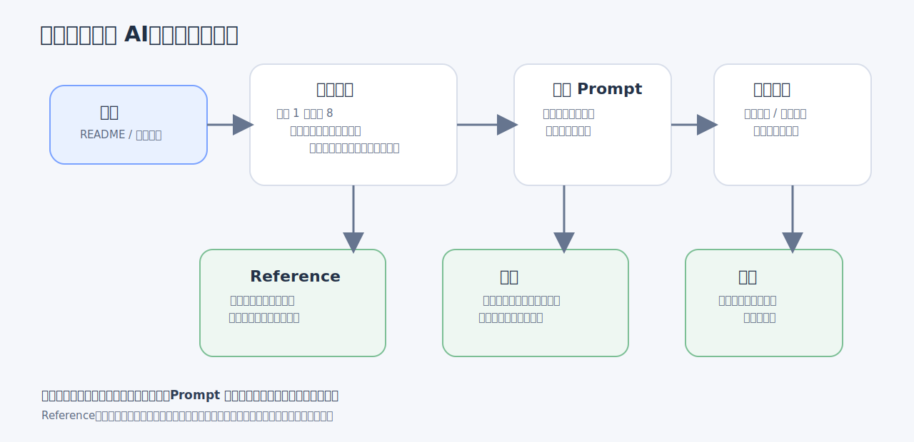
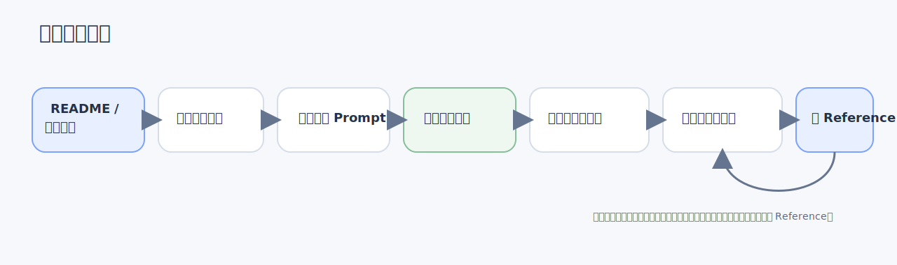
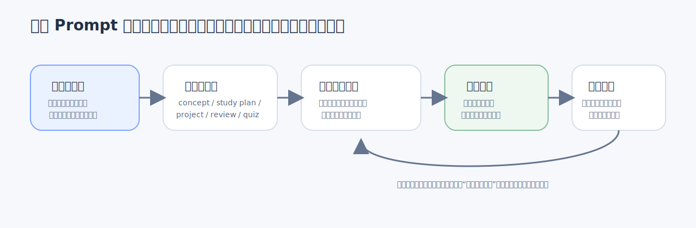

# 职场🐮🐎的AI课-3分钟快速理解，让你的token动起来

这是一套面向“会一点 AI，但不系统”的新人的训练手册。目标不是把学习者变成研究员，而是让学习者形成一条稳定的学习闭环：知道 AI 是什么，知道怎么和 AI 协作，能用 AI 帮自己理解知识和改小工具，并能通过题库、评分和复盘持续迭代。




课程总目标：

1. 说清楚 AI 是什么，不是什么。
2. 会用 AI 辅助学习，而不是只会闲聊。
3. 会用 AI 做基础 coding 协作，能改小工具。
4. 会搭自己的学习闭环：资料 -> 理解 -> 练习 -> 测试 -> 复盘。
5. 建立验证、复盘和边界意识，避免把 AI 直接当答案机器。

## 课程结构

当前课程只保留 5 个部分：

- 目录
- 课程模块
- 课程考核
- 学习 Prompt
- Reference



- 目录
  - [README](README.md)
  - [课程总览](docs/course-overview.md)
- 模块文档
  - [模块 1：AI 基础](docs/modules/module-1-ai-basics/AI基础.md)
  - [模块 2：提示词、上下文与协作](docs/modules/module-2-prompt-context-collaboration/提示词上下文与协作.md)
  - [模块 3：工具版图](docs/modules/module-3-tools-landscape/工具版图.md)
  - [模块 4：AI Coding 基础](docs/modules/module-4-ai-coding-basics/AICoding基础.md)
  - [模块 5：搭建学习系统](docs/modules/module-5-build-learning-system/搭建学习系统.md)
  - [模块 6：常见误区与边界](docs/modules/module-6-misconceptions-and-boundaries/常见误区与边界.md)
  - [模块 7：Vibe Coding 范式](docs/modules/module-7-vibe-coding/VibeCoding范式.md)
  - [模块 8：使用 Gemini 绘制系统架构图](docs/modules/module-8-gemini-architecture-diagrams/使用Gemini绘制系统架构图.md)
  - [模块 9：使用 Gemini 与 Codex 生成可控 PPT](docs/modules/module-9-gemini-codex-editable-ppt/使用Gemini与Codex生成可控PPT.md)
  - [模块 10：人机互换](docs/modules/module-10-human-ai-role-reversal/人机互换.md)
- 课程考核
  - [考核与回炉机制](docs/assessment-policy.md)
  - `quizzes/`
- 学习 Prompt
  - `templates/`
- Reference
  - [参考资料](docs/reference.md)
- 脚本与测试
  - `scripts/`
  - `tests/`

## 使用流程

如果把这套课程看成一个最小学习系统，它的使用顺序大致是先建立地图，再进入模块，再借 Prompt 把理解落成动作，最后用考核和复盘把闭环收住。



这条流程的重点不是“按顺序点完所有文件”，而是让每一步都有明确角色。模块负责建立概念和方法，Prompt 负责把任务说清楚，题库和考核负责逼出真实理解，Reference 则负责在需要时补官方依据。

## 学习 Prompt 使用说明

`templates/` 里的 Prompt 不是拿来收藏的，而是拿来直接改、直接用的。更稳的方式不是临场想到什么问什么，而是先判断自己现在卡在哪一步，再选对应模板。



如果你是刚接触一个新主题，不知道从哪里开始，优先用 `concept-learning-prompt.md`。如果你已经知道要学什么，只是不知道怎么拆成几天、每天做什么，就用 `study-plan-prompt.md`。如果你读的是代码仓库、脚本或项目材料，优先用 `project-understanding-prompt.md`。如果你已经做完题，知道自己答错了但说不清错在哪里，就直接用 `review-and-remediation-prompt.md`。如果你已经整理出一批知识点，想把它们变成题库，再用 `quiz-generation-prompt.md`。

实际使用时，不要把模板原样丢给模型。先把方括号里的占位内容换成你自己的主题、当前水平、时间预算、输出要求和边界。能写具体就不要写抽象，例如不要只写“帮我学 AI”，而要写“我已经知道 Chat 和 Search 的区别，但不会判断什么时候该用 Agent；我每天只有 45 分钟；请先给我 3 天计划，再给每天 3 个检查点”。

一轮用完之后，也不要急着换模板。先看输出有没有真的帮你推进任务：如果回答太泛，通常是目标太空；如果回答太深，通常是当前水平写得不够清；如果回答看起来很顺但用不上，通常是输出格式和验收条件没有写明。Prompt 的价值不在“句子漂亮”，而在它能不能把任务压到一个可执行、可验证的状态。

## 如何学习

建议按下面顺序执行：

1. 先读 [课程总览](docs/course-overview.md)，建立整体地图。
2. 按模块推进学习，并同步使用 `templates/` 里的 Prompt 模板。
3. 完成阶段测验和期末题库，低于 80 分时按 [考核规则](docs/assessment-policy.md) 回炉。
4. 遇到概念、项目理解或复盘任务时，优先复用现成 Prompt。
5. 需要外部资料时，再回到 [参考资料](docs/reference.md) 查官方来源。

## 如何运行验证

本仓库优先使用 Python 标准库，不依赖第三方包。

```bash
python3 scripts/validate_quizzes.py
python3 -m unittest discover -s tests -v
```

如果本地安装了 `make`，也可以使用：

```bash
make validate
make test
```

## 你会得到什么

- 一套清晰可执行的 AI 入门课程结构。
- 一组可复用的学习提示词模板。
- 一套围绕理解、练习、测试、复盘的题库和考核规则。
- 一套强调验证、复盘与边界意识的学习框架。
