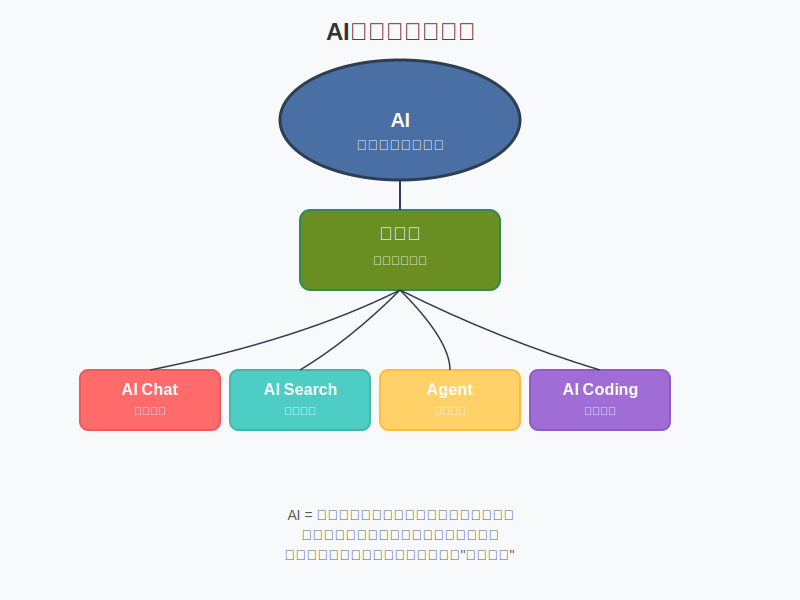

# 模块 1：AI 基础

## 学习目标

- 说清楚 AI、大模型、AI Chat、AI Search、Agent、AI Coding 的区别。
- 知道 AI 擅长做什么，不擅长做什么。
- 学会判断一个任务适不适合交给 AI。
- 开始把 AI 当成一种工作中的思维方式，而不只是一个对话工具。

## 核心概念

- AI：人工智能，指让机器表现出某种"像会思考"的能力。
- 大模型：用海量数据训练出来的通用模型，像一个读过很多材料的"压缩知识引擎"。
- AI Chat：以对话为主，适合问答、解释、重写。
- AI Search：以检索为主，重点是找资料和给出处。
- Agent：能围绕目标调用工具、分步骤执行任务的系统。
- AI Coding：用 AI 协助读代码、写代码、改代码、测代码。
- vibe coding：先把想法快速做成可运行雏形，再逐步收紧质量和验证。

### AI 的思维模式

- 把 AI 当成一种思维方式，而不只是一个对话框：重点不是“我还能问它什么”，而是“我的任务里，哪些思考步骤可以交给它先处理”。
- 把 AI 当成一种“胶水”：它的价值常常不在于直接给出最终答案，而在于帮你连接资料、思路、工具和执行流程。
- 把 AI 当成可拓展的“脚手架”：面对代码库、数据、文档或外部 API 时，你往往需要补上下文、补约束、接工具，才能让它真正进入具体场景。

### 概念关系图

理解这些概念的关系很重要。下面的图展示了AI作为能力集合，其核心是大模型，而各种工具（AI Chat、AI Search、Agent、AI Coding）都基于大模型构建，适用于不同场景。选择工具取决于任务需求，而非工具的"高级程度"。

## 用大白话解释

把 AI 想成一个实习生会更稳妥。它反应快、见得多、表达能力强，但不是全知全能，也不是天然靠谱。

- 大模型像一个“压缩过的大脑笔记本”，能根据你给的上下文组织答案。
- AI Chat 像一个口头讲解员，适合帮你解释和整理。
- AI Search 像一个资料员，重点是找到东西，不是替你下结论。
- Agent 像一个会跑腿的助理，但它干活前提是你把目标、工具和边界说清楚。
- AI Coding 像一个结对编程搭子，能帮你想方案、解释报错、改小功能，但最后仍要你验证。
- 更进一步看，AI 不是只在“问问题”时才出现，它也可以嵌进你的工作流程里，替你先拆问题、补资料、列方案、搭桥接工具。

## 常见误区

- 误区 1：AI 懂很多，所以它一定是对的。
- 误区 2：会聊天就等于会用 AI 工作。
- 误区 3：只要任务说清楚一点，AI 就什么都能做。
- 误区 4：Agent 比 Chat 高级，所以任何事情都该上 Agent。
- 误区 5：AI 是一个一键生成结果的终点，而不是需要你持续协作、连接和校验的中间环节。

## 最小练习

练习 1：用自己的话分别解释“AI Chat”和“AI Search”的区别，每个只用两句话。

练习 2：列出你最近 3 个任务，并判断：

- 哪个适合 AI 帮忙
- 哪个只适合 AI 辅助
- 哪个不该直接交给 AI

练习 3：回想一个你最近做过的工作任务，再补充回答：

- 这个任务里，最适合先“外包”给 AI 的思考步骤是什么？
- 如果把 AI 当成“胶水”，它可以帮你连接哪两部分信息、资料或工具？

## 推荐追问

- “如果我要判断一项任务能不能交给 AI，最少看哪 3 个条件？”
- “AI 特别容易在哪些场景下答得像对，但其实不稳？”
- “Agent 和自动化脚本最大的区别是什么？”
- “如果我想把 AI 协作变成工作里的第一反应，应该先从哪类任务开始？”

## 小结

这模块的核心不是背定义，而是建立一张地图：AI 是能力集合，不是单一工具；工具不同，适用任务不同；任何结果都需要结合上下文和验证动作。再往前走一步，是把 AI 从“等你提问的工具”变成工作流里的思维伙伴，让它参与拆解、连接和推进任务，而不是只负责最后生成一段答案。

## Reference 索引

- [参考资料](reference/参考资料.md)：本模块用到的官方链接、延伸阅读与课程内对照材料。
