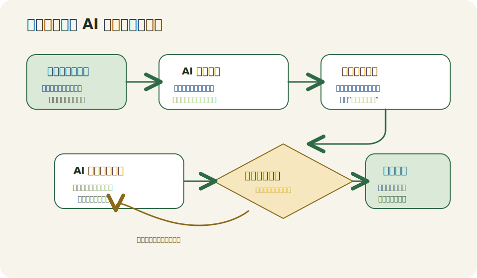

# 模块 10：人机互换

这个模块要解决的，不是“怎么把问题问得更漂亮”，而是另一个更容易卡住的点：很多任务一开始并不是缺答案，而是缺理解。人脑子里只有一个模糊目标，表面上像是在提需求，实际却把大量关键条件、省略前提和默认判断都藏在没说出口的地方。

“人机互换”讲的，就是在这种时候先把主动权暂时让出来，不急着让 AI 直接给方案，而是让 AI 先主导提问、重述和分析。人负责不断补信息、修正误解、确认边界，AI 负责把隐藏条件挖出来，把问题理解推到一个更高置信度的状态，然后再进入解释、规划或生成阶段。

## 关键概念与解释

第一，主动权切换，不等于责任切换。这里说的“让 AI 主导”，重点是让它先决定该问什么、先澄清什么、先补哪块信息，而不是把最后的目标、边界和责任也一并交出去。它和“你替我做决定吧”最大的区别，在于人始终保留目标定义权和结果验收权。

第二，连续追问，不是把一个问题换着说几遍。真正有效的追问，会沿着事实、约束、优先级、失败代价、参与者和时间窗口不断逼近问题本体。它和普通聊天式问答的差别在于，普通问答默认“问题已经成型”，连续追问则默认“问题本身还没成型”。

第三，隐含条件比显性要求更容易决定结果。很多人会写“帮我做个学习计划”“帮我分析我的性格”“帮我规划方案”，但没有说清楚默认条件，比如时间预算是多少、哪些选项根本不能碰、什么算成功、什么绝对不能出错、自己到底是想被安慰还是想被挑战。这些没说出口的前提，往往比表面需求更影响答案质量。它和补充细节不同，补细节是在加信息，找隐含条件是在修正问题边界。

第四，置信度收束，是这套方法里真正的出口。AI 不是为了永远追问下去，而是要在适当的时候停下来，明确说出“我现在怎么理解你的目标”“还剩哪些待确认假设”“如果按当前理解往下做，风险在哪里”。它和无限澄清的区别在于，前者是为了进入高质量执行，后者只是把执行往后拖。

下面这张图，把“人机互换”的基本节奏压成了一条链路。重点不在轮次多少，而在每一轮都要让理解更具体、边界更清楚、假设更少。



如果把这条链路记住，你会发现它并不只适合写 Prompt。它更像一个思考框架：先确认目标，再暴露缺口，再补条件，再重述理解，最后才进入方案、讲解或生成。

## 应用场景

它最适合快速学习陌生概念的场景。很多人学新东西时，习惯一上来就问“什么是分布式事务”，结果模型按百科口径讲完一大段，自己仍然不知道难点在哪里。换成“让 AI 先测、先问、先拆”，模型就能先判断你已经懂什么、误解什么，再决定该从定义、类比、局限性还是工程难点切入。

它也很适合方案规划。比如你想做一套培训方案、产品方案或个人转岗计划，表面目标通常都很宽，但真正决定方案质量的，是对象是谁、预算多少、周期多长、谁拍板、哪些资源已经确定、哪些约束不能改。让 AI 先主导澄清，能明显减少“方案写了很多，结果没法执行”的情况。

还有一种常见用法，是做自我反思和行为偏好梳理，但这里要特别注意边界。AI 可以帮助你追问自己的行为模式、决策习惯、情绪触发点和长期偏好，用来做复盘和表达整理；但它不适合代替专业心理评估，也不该把对话结果包装成带诊断意味的结论。换句话说，它适合帮你看清自己怎么想，不适合替你给自己下定义。

## 举例说明

假设一个新人想快速学懂“分布式事务”。如果他直接问“给我讲讲分布式事务”，模型大概率会从两阶段提交、最终一致性、Saga 这些术语一路讲下来，看起来很完整，但新人未必知道自己到底卡在哪。于是他换了一种方式，不再让 AI 直接开讲，而是先要求 AI 扮演领域专家和苏格拉底式导师，先出 3 到 5 道选择题做前测，再根据回答判断误区，之后只按“实体、关系、业务价值”三个维度去拆概念，并且每轮先提问、后解释、单次输出不超过 500 字。

这时，对话的主动权就变了。AI 不再急着回答“定义”，而是先判断这个新人到底是混淆了一致性和可用性，还是根本没建立“事务为什么存在”的直觉。接着，AI 会继续追问：他是为了准备面试，还是为了理解公司系统；他更适合先看工厂协作类比，还是先看电商下单场景；他真正需要的是建立本体结构，还是分辨工程实现的边界。几轮之后，新人不仅更懂概念，也更清楚自己原来漏掉了哪些默认前提。最后再做结业评估时，题目考查的就不只是“记住名词没有”，而是他能不能在新场景里判断这个概念该怎么用、哪里会失效。

如果你想直接复用这个快速学习场景，下面这段就是原始参考提示词，保留代码块是为了方便直接复制和二次改写：

```text
深度学习通用提示词 (升级版)

角色设定：你是一位领域专家和苏格拉底式的导师。我正在学习 [输入你想学的概念，例如：分布式事务、零信任架构、区块链共识机制等]。请不要直接向我灌输枯燥的理论，我们要通过“本体论思维”来解构它。

教学流程：
前测互动： 请先向我提 3-5 个精心设计的选择题，评估我的当前认知水平，定位我可能存在的误区。
概念拆解： 结合我的回答，将该概念拆解为“核心要素（原子化/对象）”、“逻辑层（关系/链接）”和“应用层（业务价值）”。
场景化建模： 用一个具体的、非技术领域的类比（如工厂、城市、生物）来帮我建立心理模型。
互动升华： 引导我探讨该概念的“底层局限性”或“工程落地难点”。
结业评估（强制）： 在最后阶段，请生成 3-5 个具有一定挑战性的综合应用题（可以是选择题或情景判断题），考查我是否真正理解该概念的核心本质。
反馈总结： 根据我的回答给予评分、解析误区，并给出后续的学习方向。
教学规则：
节奏控制：请遵循“先提问、后解释”的节奏，不要一次性输出超过 500 字。
思维框架：在解释概念时，请始终基于“本体论”思维，强调“实体（Object）”、“关系（Link）”和“业务价值（Business Value）”这三个维度。
动态调整：每一轮结束后，请根据我的反馈，决定是继续深入还是进入下一个阶段。
现在，请告知我：我们第一步先从什么概念开始？并给出你的前测题目。
```

再看一个方案规划的例子。一个团队负责人说，自己想做一套“新人 AI 入门训练营”。如果直接让 AI 出方案，往往很快就会得到一份结构完整的周计划，但里面默认的是理想学员、理想时间和理想执行条件。后来他改成让 AI 先提问：培训对象是产品、运营还是研发；每周能投入几小时；是否必须包含实操；公司允许使用哪些工具；最后是要做汇报、考试还是产出作品。问到这里，他自己才意识到，真正的限制不是内容不够，而是时间太碎、角色混杂、验收标准不清。AI 在这时再重述目标并给方案，产出的东西就不再是“看起来像方案”，而是更接近真实组织条件下能执行的训练设计。

## Reference 索引

- [参考资料](reference/参考资料.md)：本模块用到的官方 Prompt 文档、课程内对照材料和进一步延伸入口。
- [快速学习案例](reference/快速学习案例.md)：把本模块里的“快速学习陌生概念”场景单独整理成可直接改写的提示词骨架。

## 模块小结

“人机互换”真正要建立的，不是一个新鲜说法，而是一层更实用的判断：当目标还很模糊时，最该先优化的不是答案，而是理解。只要问题还没被说清，直接让 AI 生成内容，往往只是更快地产生偏差。

更稳的节奏是，先把提问权暂时交给 AI，让它把缺口、假设、默认条件和边界问出来；等理解已经收束到足够可信，再让它进入解释、规划、生成或评估。你以后不管是学新概念、梳理自我认知，还是推进复杂方案，都会越来越依赖这条顺序，而不是依赖某一句“神提示词”。
