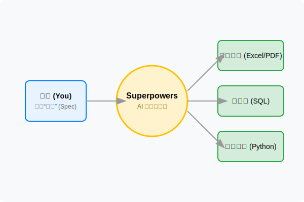
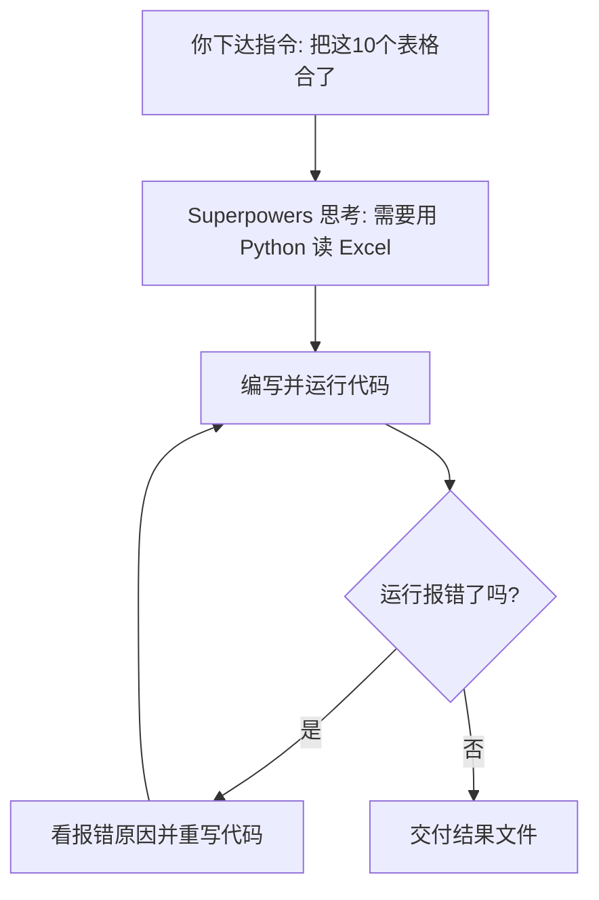

# 使用 Superpowers：给你的命令行装上“大脑”

你可能听过“人工智能可以写代码”，但你是否遇到过：AI 写的代码拷下来运行报错，你还得去求它修；或者你根本不知道该把代码存哪、怎么运行。Superpowers 就是为了解决这个“最后一公里”而生的。它让你的命令行（CLI）从一个只能敲死命令的黑框，变成一个能听懂中文、自动写代码、自动跑通、甚至报错了会自己修的“超级助手”。学完这个模块，你将理解一种全新的工作方式：你负责定义结果，AI 负责搞定过程。

### 1. 关键概念与解释

在深入细节前，我们先通过一张图看清 Superpowers 在你的电脑里扮演什么角色。它就像一个“翻译官”和“执行官”，把你的中文指令转化成电脑能懂的各种操作。

**规格驱动编程 (Spec Coding)**
对于普通人来说，这就是“甲方思维编程”。传统的编程是“写过程”（How），你要告诉电脑先开文件，再遍历行，最后保存。而 Spec Coding 是“写规格”（What），你只需要描述你想要的结果（比如“我要一个按销售额排序的饼图”）。Superpowers 会根据这个“规格”去调度工具，直到达成你想要的目标。

**Superpowers (这个工具本身)**
它是运行在你的电脑终端里的一个“智能代理”。你可以把它理解为一个住在命令行里的高级实习生。它不仅有大模型的智力，还有操作你电脑文件、运行脚本、连接数据库的“手脚”。最重要的是，它开源且完全透明，所有的操作都在你的控制之下。

**自动纠错循环 (Self-Correction Loop)**
这是 Superpowers 最像人的地方。如果它写的代码运行失败了，它不会停下来等你去修，而是会读取报错信息，思考哪里出错了，自己改好代码再跑一次。直到它确认结果正确，才会把最终产物交给你。

**上下文感知 (Context Awareness)**
在 Superpowers 里，“上下文”就是它能看见的一切：你当前文件夹里有哪些文件、文件的表头叫什么、你的环境变量里有没有数据库密码。你不需要反复告诉它“文件名叫什么”，它自己会去“看”。

### 2. 应用场景

**零代码处理海量 Excel 表格**
办公场景中最让人头疼的就是“表哥表姐”式的工作：从 50 个分公司的 Excel 里提取特定数据，或者把格式乱七八糟的地址信息统一化。在 Superpowers 中，你不需要学习复杂的 Python 库（如 Pandas），只需要描述清洗规则，它就会在你本地生成并执行处理逻辑。

**跨系统的“一句话”分析报表**
以前要写个分析报表，你得去数据库导数据，再进 Excel 做透视表。现在你可以直接说：“帮我连上那个 MySQL 数据库，查一下上个月退货率最高的三个产品，顺便结合文件夹里的‘产品手册.pdf’分析一下原因，最后给我个 Markdown 报告”。它会跨越数据库、文件系统和文档读取，直接给结果。

**业务数据的年度“大综述”**
到了年底，我们需要阅读过去一年的周报、月报，并对比财务系统的数字。这是一个巨大的工程。你可以让 Superpowers 批量读取过去一年的所有文档，提取关键 KPI，并与数据库里的真实流水进行对账，自动找错并生成年度分析。

### 3. 举例说明

**案例一：行政专员小王的“跨格式合并”**
小王要统计全公司 300 人的体检报告，但有的部门交的是 Excel，有的是 CSV，还有的是 PDF 里的表格。手动复制要花一整天。小王打开 Superpowers，输入：`"读取目录下所有体检相关文件，提取姓名和体检日期，如果有‘异常指标’也一并列出，最后存成一份总表"`。Superpowers 自动识别了不同文件的读取方式，甚至用 OCR 技术“读”了 PDF，五分钟就帮小王完成了任务。

**案例二：财务主管张姐的“异常对账”**
张姐发现银行流水和公司系统的订单额对不上，差了 125.5 元。她不想一行行看几千条数据，于是告诉 Superpowers：`"连接数据库订单表，读取我桌面上那份‘银行流水.xlsx’，找出所有金额对不上的日期和订单号"`。Superpowers 快速写了一个比对脚本，精准指出了是因为两个订单的退款逻辑在不同系统里计算方式不一致导致的。

### 4. Reference

- [Superpowers GitHub 仓库](https://github.com/obra/superpowers)：官方源代码，适合查看最新的功能支持和安装指南。
- [Spec Coding 深度指南](https://github.com/obra/superpowers/blob/main/README.md)：官方文档，教你如何写出更精准的“规格”描述。

### 5. 模块小结

不要把 Superpowers 当成一个简单的聊天工具，它是一个“行动工具”。在 CLI 环境下，它最大的价值是消灭了“配置环境”和“调试代码”的痛苦。对于小白来说，你最该带走的一层判断是：**如果一个任务可以通过描述“结果”来定义，那么就不要去纠结“过程”怎么写。** 好的意图描述，就是你最强大的超能力。
