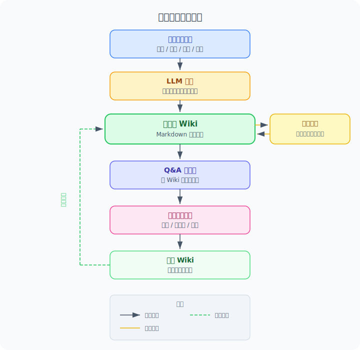

# 模块 12：个人知识库与AI记忆

大多数人用 AI 的方式是"一次性聊天"：问完就关，下次再开一个新对话。问题在于，你和 AI 之间积累的所有理解、偏好、背景信息，全部散落在一条条对话历史里，换个工具就全没了。更糟的是，有些平台号称"越用越懂你"，但那个"懂"藏在后台，你看不见它记了什么、用了什么、漏了什么。

这个模块讲的不是怎么和 AI 聊得更好，而是一个更根本的问题：你和 AI 之间的知识，到底应该存在哪里、以什么形式存在、谁来控制它。答案是，把这些知识变成一组你自己拥有的本地文件——Markdown、图片、PDF——让任何 AI 都能读取、任何工具都能处理，而你随时可以打开、检查、修改、带走。

## 关键概念与解释

第一，显式记忆与隐式记忆的区别。当你用某个 AI 平台聊了几百轮之后，它可能"记住"了你的一些偏好，但这种记忆是隐式的：你不知道它到底记了什么，也没法直接打开一个文件去查看和修正。个人知识库走的是另一条路，它把所有关于你的信息、你的研究、你的偏好都写成明文的 Markdown 文件。你可以像翻一本百科全书一样浏览它，确认 AI 知道什么、不知道什么、哪里记错了。这个差别不是技术细节，而是控制权的差别：隐式记忆的控制权在平台手里，显式记忆的控制权在你手里。

第二，File over App，文件优先于应用。这个哲学的核心观点是：应用会过时、会停服、会改价格，但文件是持久的。当你把知识存成 Markdown 和图片这样的通用格式，你就不再依赖任何特定的应用来读写它。你可以用 Obsidian 来浏览，用 VS Code 来编辑，用命令行工具来搜索，用任何 AI Agent 来处理。数据的生命周期应该比任何一款应用都长，这是 File over App 最核心的一层判断。

第三，BYOAI，Bring Your Own AI，自带你的 AI。一旦知识库是一堆本地文件，你用哪个 AI 来"插入"这些信息就完全是你的选择。今天你可以让 Claude 读这些文件来回答问题，明天换成 Codex 或者一个开源模型也行，后天你甚至可以拿这些文件做微调数据，训练一个真正在权重里"认识你"的模型。AI 公司必须持续证明自己值得被你选中，因为你的数据不被任何一家锁定。

第四，LLM 编译。Karpathy 用了一个特别贴切的比喻：把 LLM 当成"编译器"。你收集的原始资料——网页文章、论文、代码仓库、会议笔记——是"源代码"，LLM 把它们加工成结构化的 Wiki 文章，这个过程就是"编译"。编译出来的 Wiki 不是原文摘抄，而是经过分类、摘要、反向链接和概念索引的结构化知识。关键在于，人几乎不直接编辑 Wiki，这是 LLM 的活。你负责收集原始材料和下达编译指令，LLM 负责把散乱的输入变成可导航的知识结构。

第五，知识库健康检查，也就是 Linting。代码有 Linter 帮你找语法问题和风格问题，知识库也可以。你可以让 LLM 定期扫描整个 Wiki，找出前后不一致的数据、补上缺失的条目、发现不同文章之间潜在的新关联、甚至用联网搜索去填补过时的信息。这不是一次性整理，而是持续的维护循环，让知识库越用越健康，而不是越堆越乱。

下面这张图展示了个人知识库从建设到使用的完整循环。重点不是步骤本身，而是每一步的输出都会回流成下一步的输入，形成一个不断积累的飞轮。

看完这张图，你应该抓住一个要点：这不是"整理一次就结束"的事情，而是一个持续转动的循环。每次你对 Wiki 的提问和探索，本身就是在增强这个知识库。

## 应用场景

最典型的场景是深度研究。Karpathy 在推文中描述的就是这种用法：他对某个研究方向感兴趣，于是把相关论文、技术文章、GitHub 仓库和数据集全部索引进一个 raw/ 目录，然后让 LLM 把这些原始资料"编译"成一个 Wiki。这个 Wiki 目前大约有 100 篇文章、40 万个单词。到了这个规模，他可以直接对 Wiki 提复杂问题，LLM 会自己去翻阅相关文章、交叉引用，然后给出有据可查的回答。他原本以为需要搭建 RAG（检索增强生成）系统，但发现 LLM 自己维护的索引文件和摘要在这个量级已经够用了。

另一种场景是个人画像与 AI 个性化。Farzapedia 就是这个方向的代表：Farza 把自己的偏好、习惯、工作方式、沟通风格维护成一个个人维基。任何 AI 工具接入这份 Wiki，就能立刻"认识"他，不需要从头聊起。更重要的是，这份记忆是显式的——Farza 可以随时打开任何一篇文章，检查 AI 对自己的理解是否准确，发现问题直接修正。这比平台黑箱里的"用户画像"透明得多，也安全得多。

还有一种场景是团队知识沉淀。很多团队的知识散落在飞书文档、企业微信群、会议录音和个人笔记里，查找和复用极其困难。如果把这些散乱的资料定期用 LLM 编译成一个结构化的团队 Wiki，新人入职时可以直接对 Wiki 提问，老人查决策历史也不用翻聊天记录。关键是这些知识以文件形式存在，不会因为某个 SaaS 停服而丢失。

## 举例说明

来看 Karpathy 实际是怎么操作的。他用 Obsidian 作为前端界面来浏览所有数据。收集原始资料时，他用 Obsidian Web Clipper 浏览器插件一键把网页文章转成 Markdown 文件，然后用一个快捷键把文章里引用的图片全部下载到本地，这样 LLM 后续处理时能直接看到这些图。原始资料存进 raw/ 目录后，他让 LLM 开始"编译"：对每篇资料生成摘要，按主题归类，写出概念文章，建立文章之间的反向链接。这一步的产出就是一个完整的 Wiki 目录。

日常使用时，他直接在 Obsidian 里浏览 Wiki 和原始数据。需要深入分析时，他对 LLM 提问，LLM 会去研究 Wiki 里的相关文章然后给出答案。有意思的是，这些问答的输出他不是看完就丢，而是经常把结果"归档"回 Wiki，这样下一次查询就能利用之前的探索。他还给 Wiki 跑"健康检查"，让 LLM 找出数据不一致的地方、推荐值得进一步研究的新方向。甚至他还自己 Vibe Coding 了一个小型搜索引擎，既能通过网页界面直接搜 Wiki，也能作为命令行工具让 LLM 在处理大问题时调用。

再看个人画像的场景。假设你是一个产品经理，工作中需要频繁和不同的 AI 工具协作——用 Claude 写文档、用 ChatGPT 做竞品分析、用 Cursor 改代码。如果没有个人知识库，每换一个工具你都得重新解释自己是谁、负责什么产品、偏好什么风格。有了个人 Wiki 之后，你只需要在每个工具的上下文里指向同一个目录。Wiki 里记录了你负责的产品线、常用的分析框架、写作风格偏好、讨厌的表达方式。不管哪个 AI 读到这些文件，都能立刻进入状态，而你随时可以打开这些文件，确认它们是否准确，需要更新就直接改。

## Reference 索引

- [参考资料](reference/参考资料.md)：本模块用到的外部链接、原始推文来源和课程内交叉引用的完整索引。

## 模块小结

这个模块最该带走的判断是：AI 对你的了解，不应该是一个你看不见、摸不着、带不走的黑箱，而应该是一组你自己拥有的文件。文件是显式的，你能检查；文件是通用的，任何工具都能处理；文件是你的，不依赖任何单一平台。

Karpathy 的实践证明，这条路在研究场景已经跑通了：原始资料收集、LLM 编译成 Wiki、对 Wiki 做问答、输出归档回 Wiki、定期健康检查——整个循环几乎不需要人手动编辑 Wiki 本身。而 Farzapedia 证明，同样的思路用在个人画像上也成立：把你自己的信息维护成 Wiki，让任何 AI 都能即插即用地"认识你"。这种方式要求你付出一些管理文件目录的精力，但换来的是完整的控制权和真正的可迁移性。在 AI 工具迭代飞快的今天，把赌注压在某一个平台的记忆功能上，不如把知识握在自己手里。
