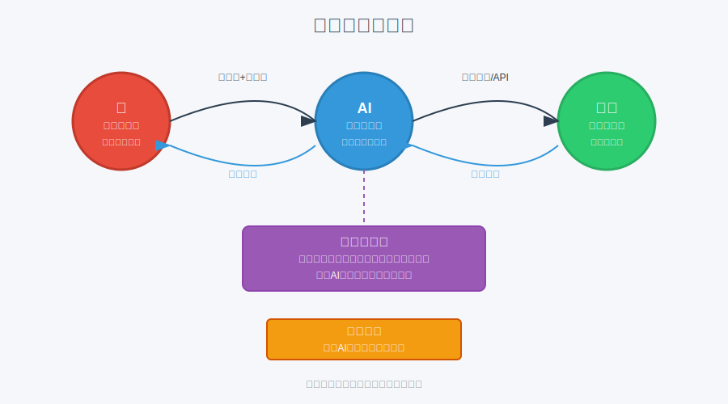

# 模块 2：提示词、上下文与协作

## 学习目标

- 理解提示词工程、上下文和元提示词的作用。
- 学会写出结构稳定的学习型提示词。
- 知道人、机器、工具如何分工。

## 核心概念

- 提示词工程：不是"神秘咒语"，而是把任务说清楚的工程化写法。
- 上下文：模型作答时能看到的背景信息，包括目标、资料、限制和历史对话。
- 元提示词：用来约束 AI 工作方式的提示词，比如要求它先澄清再输出。
- 协作链路：人负责目标和判断，AI 负责生成和整理，工具负责执行和验证。

### 协作流程图

理解人机协作的流程对于有效使用AI工具至关重要。下图展示了人、AI、工具之间的协作关系，以及提示词工程和元提示词在其中扮演的角色。良好的协作需要明确分工和稳定接口，人负责定义问题，AI处理信息与内容，工具执行自动化操作。



## 用大白话解释

你给 AI 发消息，像给一个临时加入项目的人布置任务。只说“帮我搞一下”通常不够，因为它不知道：

- 你真正想要什么
- 你已经知道什么
- 哪些内容不能碰
- 最终交付长什么样

所以一个好提示词，至少像一张任务卡：你是谁、你要做什么、参考什么、不能做什么、最后怎么交付。

## 元提示词参考

下面这段就是一个可以直接复制使用的元提示词示例。它的作用不是直接回答问题，而是先帮用户把一个普通需求改写成更稳、更清楚、更适合模型执行的高质量提示词。

```txt
你是一名拥有多年经验的提示词工程专家，擅长为 AI 模型优化提示词。你的目标是基于用户的需求，生成最佳提示词，以确保 AI 的回答详细、准确并且有帮助。

用户的需求或目标：{{在这里详细描述你的问题或目标，可以包含具体要求、上下文、限制条件或示例。例如：“请向一个初学者解释量子计算，并包含实际应用和潜在风险。”}}

为你生成的提示词需要遵循以下关键指南：
・ 保持清晰：使用简单明确的语言，必要时定义关键术语。
・ 保持具体：包含明确的操作说明，例如输出格式（如：要点式、分步骤）、长度（如：约 500 字）、或关注重点（如：优缺点分析）。
・ 保持上下文丰富：提供相关背景、示例或情境，引导 AI 的回答。
・ 鼓励详细和准确：指示 AI 进行逐步推理，提供证据或来源，避免臆造，并对观点进行充分展开。
・ 为 AI 分配角色（例如：“你是一位资深物理学家”），以增强专业性。
・ 合理组织提示结构：先定义角色，再说明任务，然后补充细节，最后给出输出要求。
・ 如果适用，可加入技巧，如“逐步推理（chain-of-thought prompting）”或“示例引导（few-shot examples）”。

输出要求：只输出优化后的提示词本身，不要添加额外解释或多余文字。
```

## 常见误区

- 误区 1：提示词越长越好。
- 误区 2：只要加一个“你是专家”，答案就会更专业。
- 误区 3：AI 答偏了，是模型笨，不是上下文缺了。
- 误区 4：有了模板，以后不用思考任务边界。

## 最小练习

把下面一句模糊请求改写成结构化提示词：

“帮我学会 Git 基础。”

要求包含：

- 目标
- 当前水平
- 时间限制
- 输出格式
- 不要涉及的内容

## 推荐追问

- “我这个提示词里缺的不是信息量，而是哪类关键信息？”
- “什么时候应该补资料，什么时候应该让 AI 先提问？”
- “如何要求 AI 在回答里标出不确定点？”

## 小结

提示词不是魔法，核心是任务建模。上下文越完整，输出越稳；边界越明确，偏航越少；格式越稳定，越适合重复使用。

## Reference 索引

- [参考资料](reference/参考资料.md)：本模块用到的 Prompt 官方资料、课程模板和对照材料。
