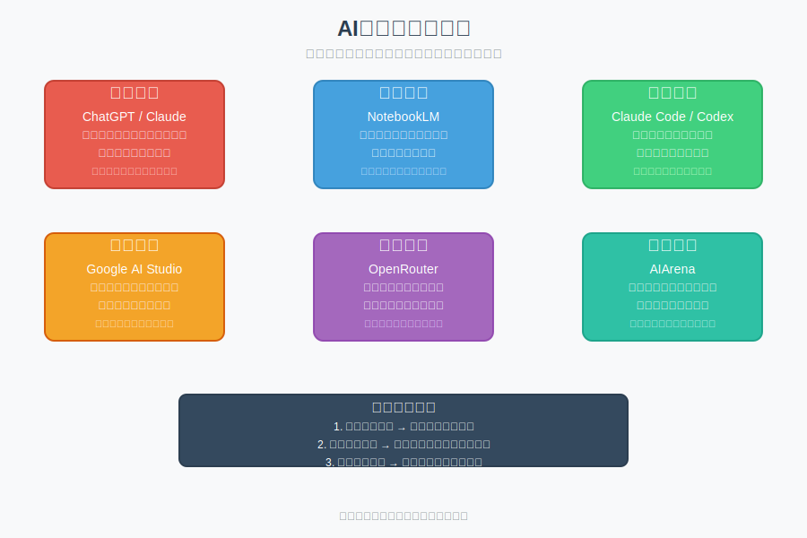

# 模块 3：工具版图

## 学习目标

- 建立对常见 AI 工具分工的基本认知。
- 能根据任务选择 Chat、Search、Notebook、Coding 工具。
- 避免“哪个火就用哪个”的工具误用。

## 核心概念

- ChatGPT / Claude：通用对话与任务协作工具，适合解释、整理、生成和多轮交互。
- Google AI Studio：适合快速试模型、调试输入输出、观察提示效果。
- NotebookLM：适合围绕你提供的资料做理解、摘要、问答。
- Claude Code / Codex / OpenCode：以代码仓库和终端协作为核心的 AI Coding 代理工具，强调在命令行直接操作本地文件、运行测试和管理上下文。
- OpenRouter：模型聚合平台，通过一个接口访问 Llama, Claude, GPT 等，方便对比模型差异。
- AIArena (LMSYS Chatbot Arena)：模型盲测评分场，了解当前业界各模型客观表现的"天梯图"。
- 工具分工：不同工具像不同工位，不同任务要去对的位置。

### 工具版图分类

理解不同AI工具的分工是高效使用AI的关键。下图展示了常见AI工具的分类和特点：对话工具像会议室适合讨论，资料工具像资料室适合文档学习，编码工具像工位适合开发，搜索工具像检索台适合找资料，平台工具像枢纽提供统一接口，评测工具像天梯图提供客观排名。选择工具时需要根据任务类型和协作需求来决定。

## 用大白话解释

不要把所有 AI 工具都当成一个按钮。更好的理解是：

- Chat 工具像会议室，适合讨论和对齐。
- Notebook 工具像资料室，适合围绕文档学习。
- Coding/Terminal 代理（如 Codex, Claude Code）像工位，适合看代码、改代码、跑命令、甚至管理整个项目工程。
- Search 工具像图书馆检索台，适合找来源和新信息。
- OpenRouter 像一个通用的“模型底座枢纽”，让你在一个地方就能试遍所有主流模型。

真正高效的人，不是只会一个工具，而是知道什么时候换工位。

## 常见误区

- 误区 1：一个工具能做所有事，所以不需要分工。
- 误区 2：有搜索就不需要理解。
- 误区 3：AI Coding 工具会写代码，所以不需要学终端和 Git。
- 误区 4：做笔记类任务时，Chat 一定比 Notebook 更好。

## 最小练习

给下面 4 个任务各选一个更合适的工具，并说明原因：

- 阅读一份 PDF 并提取重点
- 把一段代码报错定位到具体文件
- 比较两个概念的区别并追问
- 找最近更新的某个官方文档

## 推荐追问

- “如果一个任务同时需要资料、讨论和执行，应该怎么分阶段选工具？”
- “什么时候应该把 Chat 中整理好的提示词迁移到 Coding 工具里？”
- “NotebookLM 这类资料型工具最适合解决哪类学习阻塞？”

## 小结

工具不是越多越强，而是越分工越稳。用错工具，常见后果不是完全做不了，而是效率低、上下文乱、结果难验证。

## Reference 索引

- [参考资料](reference/参考资料.md)：本模块用到的工具官方入口和课程内对照材料。
