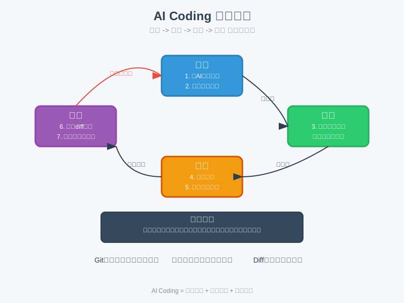

# 模块 4：AI Coding 基础

## 学习目标

- 建立终端、Git、代码理解、最小改动和验证的基本流程。
- 学会让 AI 帮你理解代码，而不是替你“盲改”。
- 知道如何验证 AI 生成的代码是否靠谱。

## 核心概念

- terminal：终端，是用文字命令和计算机交互的窗口。
- Git：版本控制工具，用来记录改动和回退历史。
- 最小改动：一次只改一小块，降低出错和回归风险。
- 验证：通过测试、运行、对照输入输出来确认结果。
- diff：两版文件之间的差异，适合检查 AI 改了什么。

### AI Coding 工作流程图

AI Coding的核心是建立一个闭环流程，确保每次改动都经过充分验证。下图展示了理解->改动->验证->复查的工作流程，以及Git、终端、Diff等关键工具在其中扮演的角色。这个闭环能帮助我们持续提升编码水平，避免错误积累。

## 用大白话解释

AI Coding 最容易出问题的地方，不是“代码写不出来”，而是“看起来能跑，你就信了”。所以流程比技巧更重要：

1. 先让 AI 解释项目是什么。
2. 再定位相关文件和函数。
3. 只改一处小功能。
4. 跑测试或最小验证。
5. 看 diff，确认改动没溢出。

这像修小家电，不是直接把整台机器拆开，而是先确认哪一部分坏了，再做最小更换和通电测试。

## 常见误区

- 误区 1：让 AI 直接“重构一下”。
- 误区 2：不理解项目结构就开始改。
- 误区 3：测试没报错，就说明逻辑一定对。
- 误区 4：AI 写得比我快，所以我不用学 Git 和命令行。

## 最小练习

找一个小脚本，要求 AI 帮你完成下面动作：

- 解释脚本入口在哪里
- 找出关键函数
- 增加一个很小的输出或参数
- 运行验证
- 总结验证结果

## 推荐追问

- “这个任务为什么应该拆成 3 个提交前检查点？”
- “如果我只能验证一件事，优先验证什么？”
- “AI 解释代码时，如何要求它标出不确定点和假设？”

## 进阶：Vibe Coding 理念

Vibe Coding 是一种更高阶的 AI 原生开发范式，它强调：
- **意图 > 语法**：你不再是写代码，而是“编排意图”。
- **上下文是生命线**：通过维护一份动态的“记忆库 (Memory Bank)”，让 AI 始终对项目全局保持清醒。
- **规划驱动执行**：拒绝 AI 的自主乱跑，要求它先写计划，每一步执行完都要你手动验证通过。

更多细节请查看：[模块 7：Vibe Coding 范式](../module-7-vibe-coding/VibeCoding范式.md)

## 小结

AI Coding 的正确打开方式不是一句“帮我写”，而是一条闭环：理解 -> 改动 -> 验证 -> 复查。只要闭环在，水平会持续增长；闭环断了，错误会稳定积累。

## Reference 索引

- [参考资料](reference/参考资料.md)：本模块用到的 Git、AI Coding 和代码验证相关资料。
