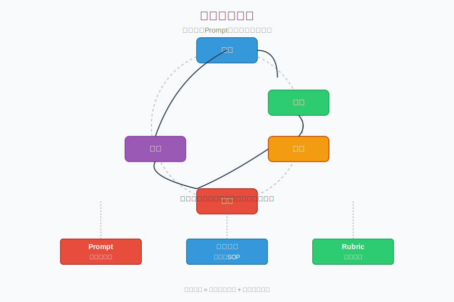

# 模块 5：搭建学习系统

## 学习目标

- 学会用 AI 生成学习计划、拆知识点、出题、评分和复盘。
- 理解一次性 Prompt 和流程模板的区别。
- 能把一个重复学习流程固化成模板。

## 核心概念

- 学习闭环：资料 -> 理解 -> 练习 -> 测试 -> 复盘。
- prompt：一次性指令，适合当前任务。
- 流程模板：带规则和稳定输出结构的可复用 Prompt 组合。
- rubric：评分标准，告诉 AI 或老师"怎么判好坏"。

### 学习系统构建图

搭建学习系统的核心是建立可验证的学习闭环。下图展示了资料->理解->练习->测试->复盘的学习闭环，以及Prompt（一次性指令）、流程模板（可复用SOP）和Rubric（评分标准）之间的区别与关系。真正的学习系统不是积累某句神提示词，而是建立一条被验证过的可复用流程。

## 用大白话解释

如果 prompt 像一次口头交代，流程模板就像一张固定 SOP，也就是标准操作流程。前者适合临时任务，后者适合重复动作。

例如你每次学新主题都要做这几件事：

- 先拆知识点
- 再生成 10 题
- 然后自测
- 最后复盘错题

这时就不该每次重新想怎么说，而应该把它固定成一份模板。

## 常见误区

- 误区 1：学习计划越满越好。
- 误区 2：AI 出题就一定能代表自己会了。
- 误区 3：只积累提示词，不积累流程。
- 误区 4：复盘就是把错题答案抄一遍。

## 最小练习

围绕“Git 基础”做一个最小学习闭环：

- 生成 3 天学习计划
- 生成 5 道题
- 写一个自评分标准
- 写一段复盘模板

## 推荐追问

- “这个学习主题最适合按什么粒度拆知识点？”
- “如何避免 AI 一次生成太多，结果自己根本吃不下？”
- “怎样设计一个流程模板，让它每次都提醒我做验证和复盘？”

## 小结

真正能长期复用的，不是某句神提示词，而是一条被你验证过的流程。流程一旦稳定，后面只是持续迭代细节。

## Reference 索引

- [参考资料](reference/参考资料.md)：本模块用到的流程模板、评分脚本和延伸资料。
