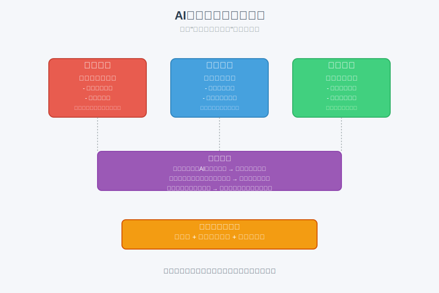

# 模块 6：常见误区与边界

## 学习目标

- 识别新人使用 AI 时最常见的误区。
- 建立“先验证、再相信”的基本习惯。
- 明确 AI 使用中的任务边界、验证边界和责任边界。

## 核心概念

- 过度依赖：把 AI 当答案机器，而不是协作工具。
- 验证：用测试、对照、原文或推理检查结果。
- 收藏代替学习：只存材料，不加工、不输出、不测试。
- 边界意识：知道什么该自己判断，什么必须验证，什么不能直接外包给 AI。

### 边界意识图

建立边界意识是避免AI使用误区的关键。下图展示了AI使用中的三个重要边界：任务边界（什么该自己判断）、验证边界（什么必须验证）、责任边界（什么不能外包）。同时也列出了常见误区如过度依赖、收藏代替学习、验证缺失等。真正的学习进步体现在能解释、能做最小练习、能指出边界这三个动作上。

## 用大白话解释

新人最容易犯的错，不是学不会，而是“以为自己学会了”。典型表现有：

- AI 说得很顺，你就信了
- 收藏了很多资料，但没做题
- 让 AI 写了很多内容，但自己解释不出来
- 看到高风险主题就想立刻“试试”

真正的学习进步，往往体现在三个动作上：

- 能解释
- 能做最小练习
- 能指出边界

## 常见误区

- 误区 1：AI 回答得完整，就代表我理解了。
- 误区 2：我把提示词存起来了，等于我掌握了方法。
- 误区 3：只要脚本能跑，就说明代码没问题。
- 误区 4：技术学习时边界问题不重要，先学会再说。

## 最小练习

写一段 150 字以内的提醒清单，标题是《我以后使用 AI 最容易踩的 3 个坑》。要求每个坑后面带一个纠正动作。

## 推荐追问

- “我现在的学习方式里，最像‘收藏代替学习’的是哪一步？”
- “如果只能保留一个验证动作，我应该保留哪个？”
- “怎样判断一个 AI 任务是效率工具，还是责任外包？”

## 小结

边界感不是给学习降速，而是防止你朝错误方向越跑越远。越早建立验证和责任意识，后面越不容易返工。

## Reference 索引

- [参考资料](reference/参考资料.md)：本模块用到的误区案例、回炉模板和验证材料。
