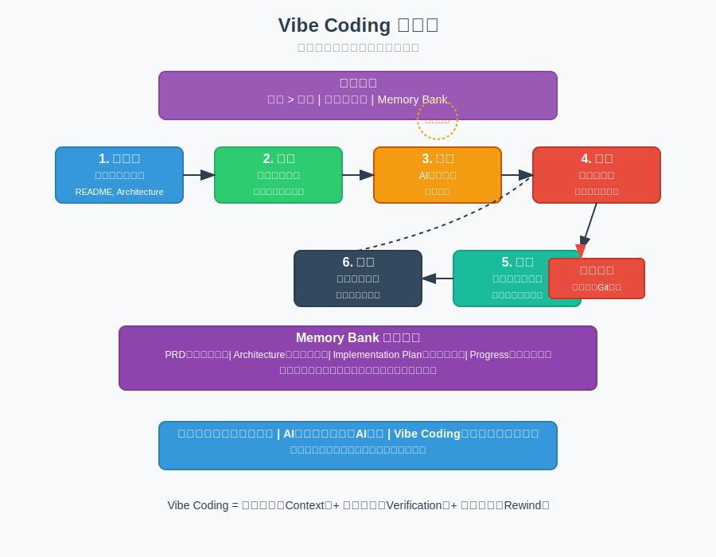

# 模块 7：Vibe Coding —— AI 原生开发范式

## 学习目标

- 理解 Vibe Coding 的核心哲学：意图（Intent）重于语法，上下文（Context）即生命线。
- 掌握 "Memory Bank" 工作流，实现跨会话的上下文一致性。
- 学会"先规划、后执行、步步验证"的开发节奏。

## 核心概念

- **Vibe (意图与氛围)**：指开发者脑中的愿景与 AI 理解之间的对齐程度。Vibe 乱了，代码就乱了。
- **Context is King (上下文为王)**：AI 的输出质量直接取决于输入的上下文。高质量的上下文输入（README, Architecture, Docs）是好代码的前提。
- **Memory Bank (记忆库)**：一组随项目演进的动态文档，记录 PRD、架构设计、实现计划和当前进度。
- **澄清循环 (Clarification Loop)**：在 AI 动手前，强制要求其阅读上下文并列出不确定的问题，直到"100% 清楚"才开工。
- **回滚技术 (Rewind)**：当 AI 陷入逻辑死循环或改出无法修复的 Bug 时，果断使用 Git 撤销，回到上一个已知的正常状态，而不是试图"修补"AI 的错误。

### Vibe Coding 工作流程图

Vibe Coding是一种AI原生开发范式，其核心是"意图重于语法，上下文即生命线"。下图展示了Memory Bank工作流的六个步骤：初始化、规划、对齐、执行、验证、同步，以及澄清循环、回滚技术等关键概念。Vibe Coding要求开发者成为总规划师，负责提供精准的上下文图纸，逐步审核每一步执行，并在出错时果断回滚。

## 用大白话解释

- **传统编程**：你是工头，自己搬砖、抹灰、对齐。
- **AI 辅助编程**：你是工头，AI 是搬砖工。你告诉它怎么搬，它搬错了你得盯着改。
- **Vibe Coding**：你是总规划师。你不搬砖，你只负责出精准的图纸（Context），并审核每一块砖的位置（Verification）。如果砖歪了，你直接拆掉重来（Rewind），而不是在歪砖上加料。

## 核心流程：Memory Bank 模式

1.  **初始化 (Initialize)**：建立项目元数据（README, Architecture）。
2.  **规划 (Plan)**：编写 `implementation-plan.md`，将大任务拆解为小步。
3.  **对齐 (Align)**：让 AI 确认计划，并提出疑问。
4.  **执行 (Execute)**：每次只执行计划中的一小步。
5.  **验证 (Verify)**：运行测试或手动确认结果，通过后才进入下一步。
6.  **同步 (Sync)**：更新 `progress.md`，确保下一个会话 AI 知道刚才发生了什么。

## 常见误区

- **误区 1：把大项目直接丢给 AI**。后果：AI 会迷失在过大的上下文中，产生不可维护的"面条代码"。
- **误区 2：跳过规划直接写代码**。后果：架构逐渐腐烂，最终导致重构成本高于重写。
- **误区 3：相信 AI 的"没问题"**。后果：隐藏的逻辑错误会随着步数增加而指数级放大。

## 推荐追问

- "如果我的项目没有测试用例，我该如何有效执行验证（Verify）步骤？"
- "在 Vibe Coding 中，什么时候该手动干预代码，什么时候该通过提示词（Prompt）纠偏？"
- "如何判断当前的'Vibe'已经坏了，需要进行一次彻底的 Rewind？"

## Reference 索引

- [参考资料](reference/参考资料.md)：本模块用到的 Vibe Coding、上下文管理和官方文档入口。