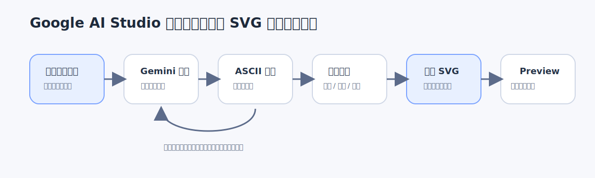
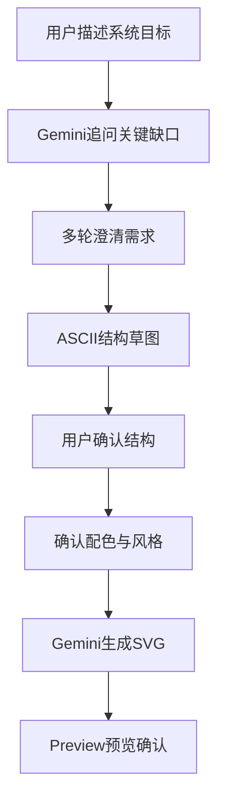

# 模块 8：使用 Gemini 绘制系统架构图

这个模块解决的是一个很常见、但很容易被低估的问题：很多人脑子里已经有了系统结构的大致想法，可一旦真要把它画出来，要么画得太早，细节全错；要么描述太散，模型直接吐出一张“看起来像图”的东西，却根本没有命中真正需求。

更稳的做法不是一上来就让模型产出最终图，而是先把“图背后的意图”聊清楚。这个模块讲的，就是如何在 Google AI Studio 里让 Gemini 先理解，再追问，再画草图，再确认风格，最后生成真正可预览的 SVG。

## 关键概念与解释

这里先把流程里最关键的几个概念讲清楚。第一，模型不是直接替你“画图”的，而是先替你整理图的语义结构。你给它的，不应只是“帮我画个系统架构图”，而应该是系统目标、核心组件、数据流、谁依赖谁、哪些点最值得强调。没有这层结构，后面的图就只能靠猜。

第二，澄清比生成更重要。这个流程里最关键的一步，不是“让 Gemini 出 SVG”，而是先让 Gemini 向人反问。比如系统是面向内部员工还是外部客户？要不要体现鉴权层？消息队列是核心路径还是可选组件？这些问题如果不问，模型很容易画出一张形式完整、含义却跑偏的图。

第三，ASCII 草图是中间态，不是临时凑合。它的价值在于把“视觉结构”先压缩到最低成本。你可以先让模型用 ASCII 画出服务边界、调用关系、上下游分层，让人快速确认“结构对不对”。这一步一旦确认，后面转 SVG 就会稳得多，因为模型不再是从自然语言直接跳最终稿，而是从一个已确认的结构稿继续推进。

第四，SVG 在这里不是“图片格式”这么简单。它本质上是文本，所以特别适合让模型生成、修改和版本对比。根据 Google 官方模型页，Gemini 3 Pro Preview 的输出是文本；这里推出来的结论是，虽然它不是图像模型，但非常适合生成 SVG 这类文本形式的图形代码。这也是为什么这条链路在 AI Studio 里是成立的。

下面这张图，把整个工作流的关键节奏压在一条线上。先描述，再反问，再出 ASCII，再确认视觉规范，最后生成 SVG。顺序一旦乱了，返工成本会明显变高。

如果你更习惯从流程角度看，也可以把它理解成下面这条链路：

## 应用场景

这种方法特别适合那类“系统已经有个大概，但还没到正式设计文档”的场景。比如产品经理要和研发对齐一套新系统，脑子里知道大概有哪些服务，但还没法一步说清楚谁连谁、数据怎么走。这时直接画正式架构图往往会失真，先让模型提问、再出 ASCII，会更接近真正的思考节奏。

它也适合方案评审前的快速收敛。很多时候，团队并不是缺一个会画图的人，而是缺一个能把含糊需求问清楚、再压成统一表达的人。Gemini 在这里更像一个架构访谈助手，而不是单纯的作图工具。它通过多轮追问，把模糊描述拆成组件、边界、流向和风格约束，最后才输出 SVG。

还有一种很实用的场景，是把“人已经确认过的草图”转成更规范的视觉版本。你可以先让模型用 ASCII 给出结构，再确认浅色风格、深色风格、主色、强调色、边框粗细、字体层级。等这些约束都定了，再让它生成 SVG，这样出来的结果才更像可以继续改的设计资产，而不是一次性的演示图。

## 举例说明

假设一个产品经理在准备讲“内部知识库问答系统”的方案。他知道系统里大概有前端、鉴权层、知识库、向量检索、Gemini 调用和日志监控，但他自己一开始并不能准确判断，哪些组件该画在主链路上，哪些该放在旁路说明里。于是他没有直接说“帮我画一个漂亮的图”，而是先在 Google AI Studio 里描述系统目的，说这是一个给内部员工用的知识问答系统，重点想让人一眼看懂用户请求怎么进来、检索怎么发生、模型怎么参与回答。

接下来，他故意要求 Gemini 不要马上出最终图，而是先连续提问，直到把图真正要表达的重点问清。Gemini 开始反问：要不要体现管理员后台？日志监控是不是核心层？知识库更新链路要不要画进去？向量检索和原始文档存储是并列还是上下游？几轮之后，产品经理自己也更清楚了，原来他真正想强调的不是“所有模块都画上去”，而是“用户请求到回答返回这条主链路必须看懂，后台更新链路只要点到为止”。

这时候，Gemini 先给了一版 ASCII 草图。产品经理一看就能立刻指出哪里不对，比如日志系统不该放在主链路中央，管理员后台不需要和普通用户并列强调。等 ASCII 结构改顺之后，他再要求模型给两套视觉规范，一套浅色、一套深色，并明确主色、强调色、连线样式和模块层级。确认完视觉规则后，再让 Gemini 输出 SVG。由于这时结构和风格都已经稳定，生成结果就不再是“撞运气”，而是一个能直接点击 Preview 查看、继续微调的可用版本。

## Reference 索引

- [参考资料](reference/参考资料.md)：本模块用到的 Google AI Studio、Gemini 模型、Prompt 设计和 Build mode 相关资料。

## 模块小结

这个模块真正要带走的，不是“Gemini 可以画图”这么一句话，而是一个更稳的工作节奏：先让模型理解，再让模型发问，再让模型给低成本草图，最后才进入正式 SVG 生成。顺序对了，图才会越来越像你要的；顺序错了，越往后改，越容易推倒重来。

如果把这套方法记住，你之后做的不只是系统架构图。流程图、能力地图、模块边界图，甚至一些轻量级产品示意图，也都可以沿着这条路径做。关键从来不是“让模型一次生成得多漂亮”，而是“让模型和人先对齐，再把图做出来”。
