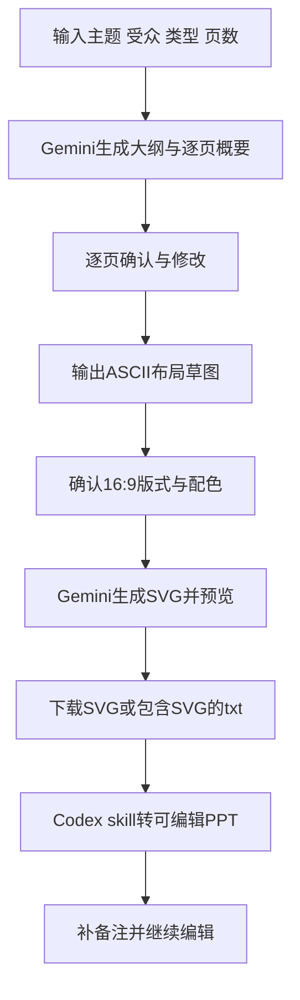
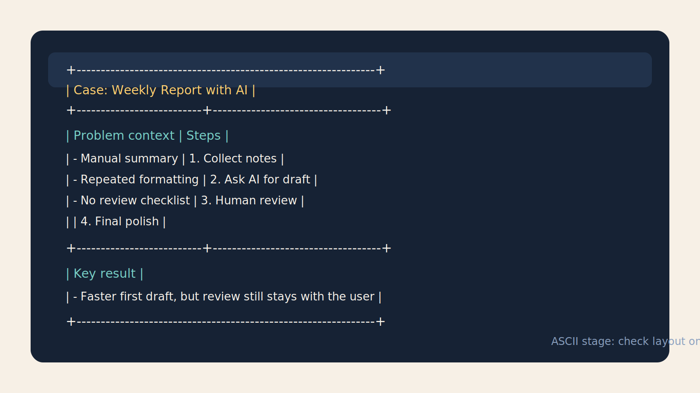
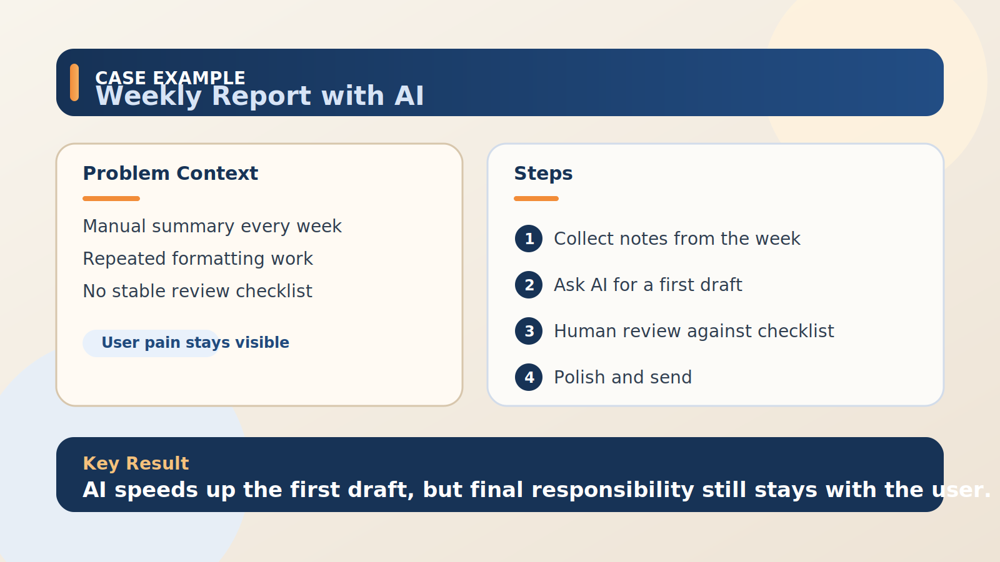

# 模块 9：使用 Gemini 与 Codex 生成可控 PPT

这个模块解决的，不是“怎么让 AI 帮我做一份 PPT”这么宽泛的问题，而是另一个更实际的难点：很多人并不缺一份看起来像 PPT 的东西，真正缺的是一条可控的生成流程。页数要先定，结构要先定，每一页讲什么要先定，版式和配色也要先定。只有这些约束先被确认，后面的生成才不会变成模型随手发挥。

这也是为什么这个模块要把 Gemini 和 Codex skill 放在一条链路里看。Gemini 负责把内容、结构和页面布局逐步问清楚并生成 SVG，Codex 里的 `svg-to-editable-ppt` skill 则负责把已经确认过的 SVG 或 `.txt` 导出文件，转成可以继续编辑的 PowerPoint。这样做的重点从来不是“全自动”，而是“每一步都能确认，最后还能继续改”。

## 关键概念与解释

第一，先冻结大纲，再进入页面细化。很多人一开始就让模型“直接做一份 10 页 PPT”，结果模型虽然给了完整输出，但页数分配、重点层级和叙事顺序往往都不是自己真正想要的。更稳的做法，是先在 Google AI Studio 里明确 PPT 类型、受众、目标和页数，让 Gemini 先只输出大纲和每一页的概要，不直接进入最终页面。

第二，逐页确认比一次性出整稿更重要。这里的“确认”不是看一眼标题对不对，而是要逐页判断：这一页的任务是什么，是讲背景、讲方案、讲对比还是讲结论；这一页要不要图；这一页最想让观众记住哪一句话。把每页职责确认清楚后，模型后续即使继续生成，也是在一个已经收紧的边界里工作，而不是自由发挥。

第三，ASCII 草图是页面布局的低成本排练。内容确认之后，不要立刻跳到正式视觉稿，可以先让 Gemini 把每一页压成 ASCII 布局，粗略表示标题区、主体区、图表区、结论区和备注区。它和最终 SVG 的区别，不是“美不美”，而是“结构有没有跑偏”。这一步修改成本最低，最适合发现某一页信息过载、左右结构失衡，或者重点根本没有被视觉上突出出来。

第四，SVG 在这里是可审查的中间格式。它不是单纯的导出图片，而是文本形式的页面描述，所以很适合让模型按 16:9 画布、固定配色方案和已确认版式去生成。你可以先在 AI Studio 里预览，再继续调整，必要时还可以把导出的 `.txt` 当作 SVG 标记文件来处理。和直接拿一张位图相比，SVG 更容易检查、修改，也更适合进入下一步转换。

第五，可编辑 PPT 才是交付态，而不是流程终点。Gemini 负责把内容和视觉结构做对，Codex 的 `svg-to-editable-ppt` skill 负责把这些已确认的页面变成真正能继续改的 `pptx`。这意味着导入 PowerPoint 后，传统的 PPT 技巧依旧适用：你可以改字、调层级、换配色、微调对齐，也可以让 Gemini 先生成每页备注，再让 Codex 把备注写进 PPT 文件里，加快整备速度。

如果把整条链路压缩成一个流程，它更像是一套“确认驱动”的制作方法，而不是一次性生成：



## 应用场景

这种方法特别适合“页数和结构必须被提前锁住”的场景。比如部门汇报、方案答辩或销售提案，真正敏感的不是模型能不能写出文案，而是不能随便多一页、少一页，也不能把重点讲散。先定大纲、再逐页确认，会比直接让模型产整套 PPT 更稳。

它也适合需要多人审稿的场景。很多团队的问题不是做不出内容，而是评审意见总在不同层次上打架。有人在改逻辑，有人在改措辞，有人在改版式。把工作拆成“大纲确认”“逐页内容确认”“ASCII 布局确认”“SVG 视觉确认”四个阶段后，讨论就能按层分开，返工量会小很多。

还有一种非常实用的场景，是最终文件必须交给别人继续编辑。比如培训讲义、客户交付材料、课程课件或者运营模板，这些文件通常不会停在 AI 导出的那一刻。它们后面还要进 PowerPoint，被不同的人继续修字、补动画、调母版、加页脚。这时“可编辑格式”就不是锦上添花，而是交付的底线。

## 举例说明

假设一个做内部培训的同学，要准备一套 8 页的“新人如何正确使用 AI 做周报和方案汇报”的课件。他如果直接让模型生成 PPT，最常见的问题就是模型把内容铺得很满，看起来完整，但第 3 页和第 4 页其实在讲同一件事，第 6 页又突然冒出一个没人要求的案例，最后只能整套重改。于是他先在 Google AI Studio 里明确：这是一份内部培训课件，受众是第一次系统接触 AI 的同事，总页数固定 8 页，每一页都要先给标题、目标和概要，不允许直接生成最终页面。

Gemini 先给出大纲后，他逐页确认内容：第 1 页只做开场和目标，第 2 页讲常见错误，第 3 到第 5 页讲正确流程，第 6 页放一个实际案例，第 7 页给操作清单，第 8 页做总结。确认完之后，他再让 Gemini 针对每一页输出 ASCII 布局，发现案例页原本把背景、问题、过程、结果全塞在左半边，看上去很拥挤，于是先在 ASCII 阶段就把页面拆成“左侧问题背景，右侧步骤与结果”的结构。等这些都稳定之后，他再确定浅色底、深蓝主色、橙色强调色，并要求输出 16:9 SVG。

下面这组示意，展示的就是同一页在两个阶段的差别。第一步不是追求视觉完成度，而是先确认版块分布和信息密度；只有这一步稳定了，第二步的 SVG 才值得进入正式预览。

```text
+--------------------------------------------------------------+
| Case: Weekly Report with AI                                  |
+--------------------------+-----------------------------------+
| Problem context          | Steps                             |
| - Manual summary         | 1. Collect notes                  |
| - Repeated formatting    | 2. Ask AI for draft               |
| - No review checklist    | 3. Human review                   |
|                          | 4. Final polish                   |
+--------------------------+-----------------------------------+
| Key result                                                   |
| - Faster first draft, but review still stays with the user   |
+--------------------------------------------------------------+
```



上面这个 ASCII 阶段，只回答一个问题：结构对不对。等结构确认后，再进入下面这种正式 SVG 阶段，此时才开始检查颜色、层级、留白和强调是否成立。



SVG 预览确认无误后，他把 AI Studio 导出的 `.txt` 文件交给 Codex，使用 `svg-to-editable-ppt` skill 转成可编辑的 `pptx`。这时 PPT 里已经不是一张平面截图，而是可以选中、修改、移动的文本框和图形。最后，他又让 Gemini 按已经确认的 8 页内容补出每页备注，再让 Codex 把备注写入对应页的 notes 区。整套课件到这里才算真的完成，因为内容、页数、结构、视觉和备注都已经在前面逐层确认过了，后面进入 PowerPoint 时就主要是微调，而不是推倒重来。

## Reference

- [参考资料](reference/参考资料.md)：本模块使用到的 Google AI Studio、Prompt 设计、SVG 与 PPT 相关官方入口。
- [svg-to-editable-ppt.zip](reference/svg-to-editable-ppt.zip)：本模块附带的 Codex skill 压缩包，适合在 AI Studio 已导出 SVG 或包含 SVG 标记的 `.txt` 后，继续转成可编辑 PPT 时使用。

## 模块小结

这个模块真正要建立的，不是“让 AI 自动做 PPT”的期待，而是一条更稳的判断：先确认内容，再确认页面，再确认布局，再确认视觉，最后才进入格式转换。这样输出的东西不会因为模型临场发挥而失控，也不会在交付时卡在“只能截图、没法再改”的死路上。

如果你把这套流程掌握住，PPT 只是一个开始。凡是那种既要多轮确认、又要求最终文件可继续编辑的任务，都可以沿用同样的思路处理。关键不是追求一次生成，而是让每一步都留下可确认、可修改、可交接的中间态。
